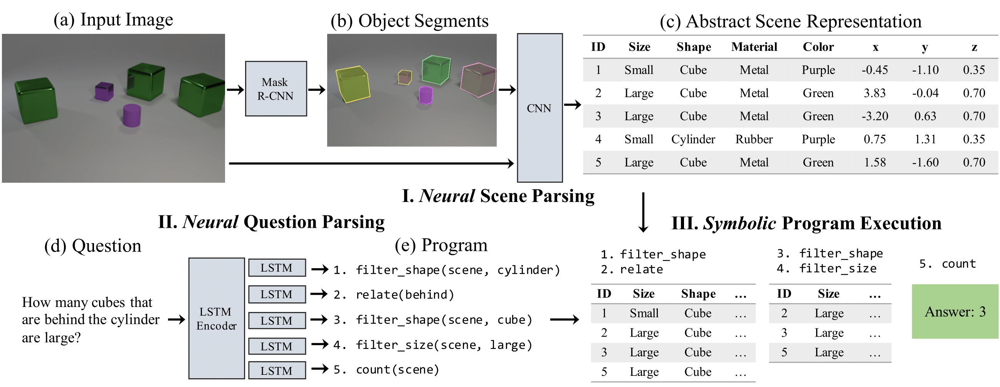

# Neural-Symbolic Visual Question Answering (NS-VQA)

Pytorch implementation for Neural-Symbolic Visual Question Answering (NS-VQA) on the [CLEVR dataset](https://cs.stanford.edu/people/jcjohns/clevr/). 

<div align="center">
  
</div>

### Publication
**[Neural-Symbolic VQA: Disentangling Reasoning from Vision and Language Understanding](https://arxiv.org/abs/1810.02338)**
<br>
Kexin Yi&ast;, 
[Jiajun Wu](https://jiajunwu.com/)&ast;, 
[Chuang Gan](http://people.csail.mit.edu/ganchuang/), 
[Pushmeet Kohli](https://sites.google.com/site/pushmeet/), 
[Antonio Torralba](http://web.mit.edu/torralba/www/), and
[Joshua B. Tenenbaum](https://web.mit.edu/cocosci/josh.html)
<br>
(* indicates equal contributions)
<br>
In Neural Information Processing Systems (*NeurIPS*) 2018.
<br>

```
@inproceedings{yi2018neural,
  title={Neural-symbolic vqa: Disentangling reasoning from vision and language understanding},
  author={Yi, Kexin and Wu, Jiajun and Gan, Chuang and Torralba, Antonio and Kohli, Pushmeet and Tenenbaum, Joshua B.},
  booktitle={Advances in Neural Information Processing Systems},
  pages={1039--1050},
  year={2018}
}
```

## Prerequisites
* Linux Ubuntu 16.04
* Python 3
* NVIDIA GPU + CUDA 9.0
* PyTorch 0.3.1 or 0.4.0

## Getting started

Clone this repository 
```
git clone https://github.com/kexinyi/ns-vqa.git
```

Create an environment with all packages from `requirements.txt` installed (Note: please double check the CUDA version on your machine and install pytorch accordingly)
```
conda create --name ns-vqa -c conda-forge pytorch --file requirements.txt
source activate ns-vqa
```

Download data and pretrained model
```
sh download.sh
```

Compile CUDA code for Mask-RCNN
```
cd {repo_root}/scene_parse/mask_rcnn/lib  # change to this directory
sh make.sh
```

Preprocess the CLEVR questions
```
cd {repo_root}/reason

# clevr-train
python tools/preprocess_questions.py \
    --input_questions_json ../data/raw/CLEVR_v1.0/questions/CLEVR_train_questions.json \
    --output_h5_file ../data/reason/clevr_h5/clevr_train_questions.h5 \
    --output_vocab_json ../data/reason/clevr_h5/clevr_vocab.json

# clevr-val
python tools/preprocess_questions.py \
    --input_questions_json ../data/raw/CLEVR_v1.0/questions/CLEVR_val_questions.json \
    --output_h5_file ../data/reason/clevr_h5/clevr_val_questions.h5 \
    --input_vocab_json ../data/reason/clevr_h5/clevr_vocab.json
```

## Run pretrained models

This part requires downloading the pretrained models and placing them under `data/pretrained`. Our full model is consisted of three networks: an object detection network; an attribute extraction network; and a neural question parser. The first two networks form a scene parser that generates an abstract scene representation of an input image. The question parser turns an input question into a program. The symbolic program executor is integrated into the question parser which executes the logic of the program and outputs an answer. 

Both networks of the pretrained scene parser are trained on the CLEVR-mini dataset as described in the training section. The question parser is trained starting from 270 ground-truth programs plus all question-answer pairs from the CLEVR training set.

### Step 1: object detection

The object detector is a Mask R-CNN which inputs raw images and generates object proposals including their class labels, masks, and scores. To run the detector, go to directory
```
cd {repo_root}/scene_parse/mask_rcnn
```
and run
```
python tools/test_net.py \
    --dataset clevr_original_val \
    --cfg configs/baselines/e2e_mask_rcnn_R-50-FPN_1x.yaml \
    --load_ckpt ../../data/pretrained/object_detector.pt \
    --output_dir ../../data/mask_rcnn/results/clevr_val_pretrained
```
The network will output a file under `{repo_root}/data/mask_rcnn/results/clevr_val_pretrained/detections.pkl`(51.3MB) that stores all the object proposals.

### Step 2: attribute extraction

The next step is to feed the detected objects into an attribute network to extract their attributes and form abstract representations of the input scenes. First, go to directory
```
cd {repo_root}/scene_parse/attr_net
```
and process the detection result
```
python tools/process_proposals.py \
    --dataset clevr \
    --proposal_path ../../data/mask_rcnn/results/clevr_val_pretrained/detections.pkl \
    --output_path ../../data/attr_net/objects/clevr_val_objs_pretrained.json
```
This will generate an object file at `{repo_root}/data/attr_net/objects/clevr_val_objs_pretrained.json`(17.5MB) which can be loaded by the attribute network.

Then, run attribute extraction
```
python tools/run_test.py \
    --run_dir ../../data/attr_net/results \
    --dataset clevr \
    --load_checkpoint_path ../../data/pretrained/attribute_net.pt \
    --clevr_val_ann_path ../../data/attr_net/objects/clevr_val_objs_pretrained.json \
    --output_path ../../data/attr_net/results/clevr_val_scenes_parsed_pretrained.json
```
The output file `{repo_root}/data/attr_net/results/clevr_val_scenes_parsed_pretrained.json`(15.2MB) stores the parsed scenes that are going to be used for reasoning.

### Step 3: reasoning

We are now ready to perform reasoning. The model first parses the questions into programs, and then run the logic of the programs on the abstract scene representations.
```
cd {repo_root}/reason
```
```
python tools/run_test.py \
    --run_dir ../data/reason/results \
    --load_checkpoint_path ../data/pretrained/question_parser.pt \
    --clevr_val_scene_path ../data/attr_net/results/clevr_val_scenes_parsed_pretrained.json \
    --save_result_path ../data/reason/results/result_pretrained.json
```
The result statistics can be found in the output file `{repo_root}/data/reason/results/result_pretrained.json`. The pretrained model will yield an overall question answering accuracy of 99.8%, same as reported in the paper.

## Train you own model

### Scene parsing

Our scene parser is trained on 4000 rendered CLEVR images. The only difference between the rendered images and the original ones is that the rendered images come with object masks. We refer to this dataset as `CLEVR-mini`, which is downloadable via the `download.sh` script. No images from the original training set are used throughout training. 

1, Train a Mask-RCNN for object detection. We adopt the implementation from [Detectron.pytorch](https://github.com/roytseng-tw/Detectron.pytorch). Please go to the link for more details.
```
cd {repo_root}/scene_parse/mask_rcnn
```
```
python tools/train_net_step.py \
    --dataset clevr-mini \
    --cfg configs/baselines/e2e_mask_rcnn_R-50-FPN_1x.yaml \
    --bs 8 \
    --set OUTPUT_DIR ../../data/mask_rcnn/outputs
```
The program will determine the training schedule based on the number of GPU used. Our code is tested on 4 NVIDIA TITAN Xp GPUs.

2, Run detection on the CLEVR-mini dataset. This step obtains the *proposed* masks of all objects in the dataset, which will be used for training the attribute network. 
```
python tools/test_net.py \
    --dataset clevr_mini \
    --cfg configs/baselines/e2e_mask_rcnn_R-50-FPN_1x.yaml \
    --output_dir ../../data/mask_rcnn/results/clevr_mini \
    --load_ckpt ../../data/mask_rcnn/outputs/ckpt/{checkpoint .pth file}
```

3, Extract the *proposed* CLEVR-mini object masks and pair them to the ground-truth objects via mask IoU
```
cd {repo_root}/scene_parse/attr_net
```
```
python tools/process_proposals.py \
    --dataset clevr \
    --proposal_path ../../data/mask_rcnn/results/clevr_mini/detections.pkl \
    --gt_scene_path ../../data/raw/CLEVR_mini/CLEVR_mini_coco_anns.json \
    --output_path ../../data/attr_net/objects/clevr_mini_objs.json
```

4, Train the attribute network on the CLEVR-mini dataset, using the proposed masks plus ground-truth labels
```
python tools/run_train.py \
    --run_dir ../../data/attr_net/outputs/trained_model \
    --clevr_mini_ann_path ../../data/attr_net/objects/clevr_mini_objs.json \
    --dataset clevr
```

### Reasoning

Go to the "reason" directory
```
cd {repo_root}/reason
```

1, Make sure the raw questions are preprocessed. If you want to pre-train on a subset of questions uniformly sampled over the 90 question families, run
```
python tools/sample_questions.py \
    --n_questions_per_family 3 \
    --input_question_h5 ../data/reason/clevr_h5/clevr_train_questions.h5 \
    --output_dir ../data/reason/clevr_h5
```

2, Pretrain question parser
```
python tools/run_train.py \
    --checkpoint_every 200 \
    --num_iters 5000 \
    --run_dir ../data/reason/outputs/model_pretrain_uniform_270pg \
    --clevr_train_question_path ../data/reason/clevr_h5/clevr_train_3questions_per_family.h5
```

3, Fine-tune question parser
```
python tools/run_train.py \
    --reinforce 1 \
    --learning_rate 1e-5 \
    --checkpoint_every 2000 \
    --num_iters 1000000 \
    --run_dir ../data/reason/outputs/model_reinforce_uniform_270pg \
    --load_checkpoint_path ../data/reason/outputs/model_pretrain_uniform_270pg/checkpoint.pt
```
The output models are stored in the folder `{repo_root}/data/reason/outputs/model_reinforce_uniform_270pg`.
